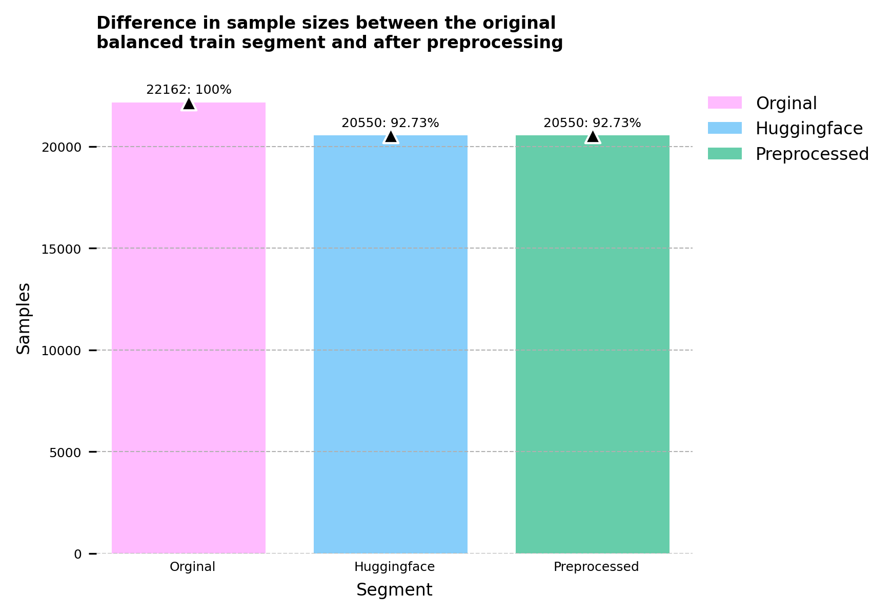

# Audioset

You can use this repository to download the waveforms from AudioSet and create data files for AST and AudioMAE recipes.

Audioset is an audio event dataset, which consists of over 2M human-annotated 10-second video clips. These clips are collected from YouTube, therefore many of which are in poor-quality and contain multiple sound-sources. A hierarchical [ontology](https://research.google.com/audioset/ontology/index.html) of 632 event classes is employed to annotate these data, which means that the same sound could be annotated as different labels. For example, the sound of barking is annotated as Animal, Pets, and Dog. All the videos are split into Evaluation/Balanced-Train/Unbalanced-Train set [(source)](https://paperswithcode.com/dataset/audioset). Explore the dataset annotations by sound class [here](https://research.google.com/audioset/dataset/index.html).

## Description
This repository is built with a focus on practical ways to obtain and work with the audio data of audio set. Due to **copyright constraints and YouTube’s evolving content**, fully reconstructing the entire dataset can be challenging. Originally, Google’s official [AudioSet page](https://research.google.com/audioset/download.html) only provides *feature embeddings*, not raw audio files (wavs). Consequently, anyone wishing to download the actual sound files must do so via YouTube video IDs—an approach complicated by the fact that many clips become unavailable over time (e.g., removed by creators or due to policy violations).

### Sources for Audio

1. **Manual YouTube Downloads**  
   - You can attempt to download each sample via its YouTube ID, but expect some percentage of links to be dead or removed by the time you attempt it.

2. **Third-Party Archives**  
   - Several providers offer pre-downloaded AudioSet clips, though availability can vary.  
   - The [Baidu link](https://pan.baidu.com/s/13WnzI1XDSvqXZQTS-Kqujg) (password: 0vc2) is described in the [audioset_tagging_cnn repository](https://github.com/qiuqiangkong/audioset_tagging_cnn). Unfortunately, **non-Chinese users** may struggle with Baidu’s registration requirements (Chinese phone number needed).  
   - Additional mirrors and archives exist on [Hugging Face](https://huggingface.co/) if you search for “AudioSet.”

### Data Used in This Repository

This repository relies on a **Hugging Face** dataset available at [confit/audioset-full](https://huggingface.co/datasets/confit/audioset-full), which was downloaded in **September 2024**. That snapshot provided:

- **Balanced training**: 20,550 clips out of 22,160  
- **Unbalanced training**: 1,913,637 clips out of 2,041,789  
- **Evaluation set**: 18,887 clips out of 20,371  

Collectively, this exceeded **1 TB** of data. Note that the actual usable clip count will be slightly lower after filtering out corrupted, incomplete, or empty files. The details of this filtering and data exploration are covered in the **EDA chapter**.

## Getting Started

To prepare your environment and run the [Data Preparation Recipes](##Data Preparation Recipes), please follow these steps:

1. **Set Up the Conda Environment**  
   - Create a Conda environment using the provided `requirements.txt`.  
   - This ensures you have all necessary Python dependencies to download and preprocess the data.

2. **Data and Label Download**  
   - Run `./src/downloads/download.sh` to download the audio files and label CSVs.  
   - This script automatically creates a `data` directory with:
     - **`data/labels`** folder containing CSV files for labels and an `ontology` folder containing `ontology.json` for class mappings.
     - **`data/audio/wav`** subfolder that holds the actual WAV files.

3. **Label & Ontology Mapping**  
   - In `data/labels`, the CSV files have a `positive_labels` column which maps to the **`id`** key in the `ontology.json`.
   - The preprocessing pipeline will merge these label files with the ontology definitions, cleaning and organizing them for further analysis.

4. **Running the Preprocessing Pipeline**  
   - After the download step completes, run the preprocessing pipeline to filter out non-functional or corrupt samples and generate usable CSVs for analysis.
   - If desired, you can then open the EDA notebook to inspect the dataset further.

5. **Preparing Data for Training**  
   - With clean CSV files in hand, you can run the recipes needed to prepare your data for training various models.

### Using `run.sh`
If you prefer a single entry point, use **`run.sh`**. This script accepts multiple flags:

- **`--pipeline`**: Downloads the data and runs the preprocessing.  
- **`--download`**: Only downloads the data.  
- **`--preprocess`**: Only runs the preprocessing pipeline.

Before running `run.sh`, do the following:

1. Create an `.env` file from the `env_template.txt` and set the **repo path** variable inside it.  
2. Run `bash run.sh [FLAGS]` (or submit it via Slurm if available).

### Downloading the Data Separately

If you only want to download the data (without the rest of the pipeline), you can call the download script directly:

```bash
chmod +x src/downloads/download.sh
sh src/downloads/download.sh
```

Or, if using Slurm:

```bash
chmod +x src/downloads/download.sh
sbatch src/downloads/download.sh
```

This will:

- Create a `data` folder with all the required subsets.  
- Create a `src/downloads/log` folder where Slurm output and error logs are stored (if using Slurm).

#### What Gets Downloaded

1. **Label CSVs**  
   - Obtained from the official [AudioSet website](https://research.google.com/audioset/download.html).
2. **Ontology Repository**  
   - Cloned from the official [AudioSet ontology repository](https://github.com/audioset/ontology), containing all class definitions.
3. **Audio Data (WAV files)**  
   - Sourced from the [Hugging Face dataset](https://huggingface.co/datasets/confit/audioset-full), which includes the audio clips for each subset.

## Preprocessing Pipeline

The preprocessing pipeline constructs a clean dataset linking WAV files, labels, and ontology metadata. It performs the following major steps:

1. **Build Initial DataFrame from WAV Files**  
   - Collects full file paths (`file_path`) and filenames (`file_name`) for each audio file in the directory.  
   - Removes extraneous prefixes (e.g., a leading “Y”) and suffixes like “.wav,” ensuring a clean YouTube ID field.

2. **Read Label CSVs**  
   - Loads label files (e.g., CSVs with columns like `YTID` and `positive_labels`).

3. **Merge DataFrames**  
   - Aligns the WAV-file data with label data on the (cleaned) YouTube ID.  
   - Drops redundant or now-duplicated columns, such as the original `filename` column.

4. **Filter Non-Existent Audio**  
   - Removes rows where the associated WAV file is missing.

5. **Add Label Lists and Names**  
   - Splits the `positive_labels` column into a structured list (`positive_labels_list`).  
   - Converts label IDs into human-readable names using an ontology (`positive_labels_names` column).

6. **Export Final CSV Files**  
   - Saves one or more CSV files (e.g., `full_balanced_train_segments.csv`) containing valid WAV files and their corresponding labels.

### Tests Conducted During the Pipeline

Alongside data cleaning and merging, several validations ensure that each WAV file is both present and readable:

- **Load Check**: Attempts to open each audio file to verify it is not corrupted.  
- **Resampling Check**: Confirms the audio can be resampled without error.  
- **Feature Check**: Computes features (e.g., filter bank “fbank”) to ensure the file content is usable for training.  
- **Duration Tracking**: Measures and records each file’s duration, ignoring (or removing) files that fail or exceed time constraints.

Any audio file that fails one or more checks is dropped from the final dataset, helping maintain data quality for subsequent training or analysis.


## Exploratory data analysis (EDA):

### File comparision




### Duration


### Class balance (eval, balanced train)

<br><br>

Please read the paper: [Audio Set: An ontology and human-labeled dataset for audio events]("https://ieeexplore.ieee.org/document/7952261") to gain a better understanding on how the dataset works.


## Data Preparation Recipes

These recipes outline how to prepare AudioSet for various audio models. They produce standardized data formats (e.g., JSON files) that you can use for training and evaluation in different frameworks.

### Audio Spectrogram Transformer (AST)

- **Preprocessing Script**  
  Run `src/recipes/ast/prepaire_audioset.py`, which generates JSON files containing only WAV file paths and corresponding labels (no image or video data). These JSONs match the format required for AST training.
  
- **from_ast_repo Folder**  
  - A folder named `from_ast_repo` contains sample files and health-check scripts borrowed from [YuanGongND/ast](https://github.com/YuanGongND/ast).  
  - You can use these scripts to **verify** that your generated JSON files match the format (and some of the properties) of the original AST dataset.

- **Train AST**  
  - After generating the training JSON, follow the instructions in the AST repository or use a `run.sh` script (as described in AST docs) to kick off model training.  
  - Make sure paths are adjusted to point to your newly generated JSON files and the correct data directories.

### AudioMAE (Masked Autoencoders that Listen)

- **Reusing AST JSONs**  
  The JSON files created for AST can be used directly with [AudioMAE](https://github.com/facebookresearch/AudioMAE). This allows you to avoid duplicating the data-preparation process.

- **AudioMAE Recipes**  
  - After verifying your data, follow AudioMAE’s recommended scripts and instructions to train or evaluate the model on AudioSet.  
  - Ensure that any paths or arguments in the AudioMAE recipes are updated to match your local dataset structure and JSON file locations.

By combining these recipes, you can seamlessly prepare AudioSet for multiple models—from AST to AudioMAE—streamlining experimentation and comparison across architectures.


## Suggestions & To-Dos

Below is a list of possible improvements and ongoing tasks that can further enhance the repository's functionality and maintainability:

- [ ] **Test the `download.sh` Script**  
  - Since the script was modified after data was already downloaded, it has not been re-run or re-tested in its current form.  
  - Add comprehensive **error handling** to ensure robust recovery if downloads fail.

- [ ] **Search for Missing Wav Files**  
  - Explore external sources to locate additional AudioSet clips or replacements for those missing or corrupted.

- [ ] **Augment Evaluation and Balanced Subsets**  
  - Incorporate samples from the unbalanced subset to **evaluation** and **balanced** subsets, mirroring the approach used in the original AudioSet paper.

- [ ] **Optionally Filter Extremely Short Clips**  
  - Provide a **flag** in the preprocessing pipeline that excludes very short audio files from training, while leaving them available for other use cases.


## Contact
If you have a question, please bring up an issue.
